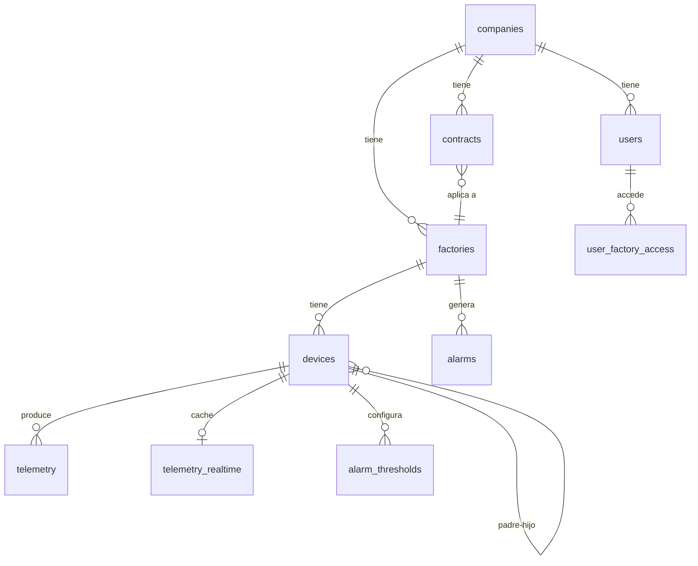
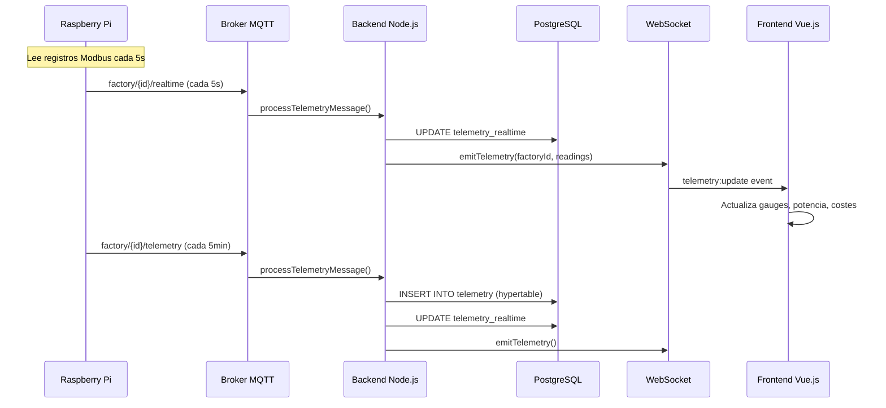
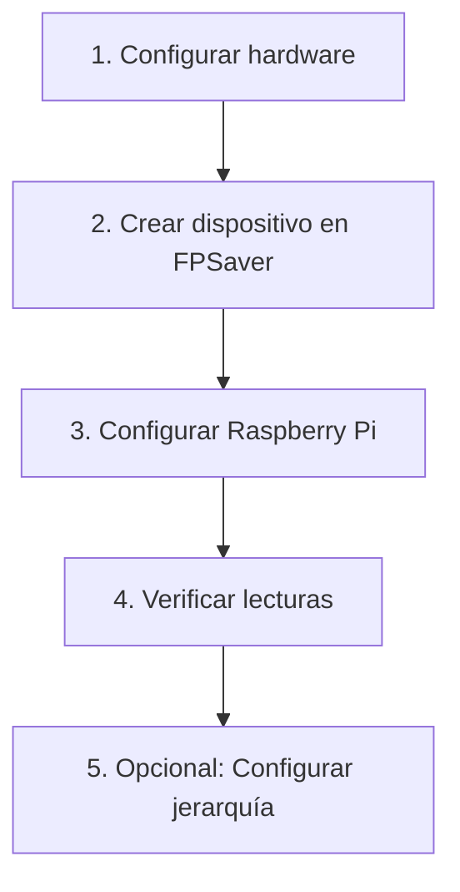

# 📘 FPSaver — Documentación Técnica del Sistema

> Sistema SaaS de monitorización energética industrial. Este documento cubre la base de datos, los cálculos en tiempo real, los informes históricos, los contratos eléctricos y la gestión de dispositivos.

---

## Tabla de Contenidos

1. [Base de Datos](#1-base-de-datos)
2. [Pipeline de Datos: Real-Time](#2-pipeline-de-datos-real-time)
3. [Cálculos y Fórmulas del Dashboard](#3-cálculos-y-fórmulas-del-dashboard)
4. [Informes Energéticos](#4-informes-energéticos)
5. [Sistema de Contratos Eléctricos](#5-sistema-de-contratos-eléctricos)
6. [Sistema de Dispositivos](#6-sistema-de-dispositivos)

---

## 1. Base de Datos

PostgreSQL 16 + TimescaleDB + pgvector

### Diagrama de Relaciones



### 1.1 Tablas del Sistema

#### `companies` — Empresas (Tenants)

Cada empresa es un tenant aislado. Todos sus datos están segregados por `company_id`.

| Campo | Tipo | Propósito |
|-------|------|-----------|
| `id` | UUID | Identificador único |
| `name` | VARCHAR | Nombre de la empresa |
| `tax_id` | VARCHAR | CIF/NIF (único) |
| `timezone` | VARCHAR | Timezone (default: `Europe/Madrid`) |
| `is_active` | BOOLEAN | Soft-delete |

---

#### `users` — Usuarios

| Campo | Propósito |
|-------|-----------|
| `company_id` | NULL para SuperAdmin (acceso global) |
| `role` | `superadmin`, `manager`, `gerencia`, `operador` |
| `email` | Login (único global) |

**Roles:**
- **superadmin**: Acceso total a todas las empresas y fábricas
- **manager**: Gestión de su empresa y fábricas asignadas
- **gerencia**: Visualización + informes de fábricas asignadas
- **operador**: Solo visualización real-time de fábricas asignadas

---

#### `factories` — Fábricas

| Campo | Propósito |
|-------|-----------|
| `company_id` | Empresa propietaria |
| `mqtt_topic` | Tópico MQTT para ingestión de telemetría |
| `comunidad_autonoma` | Para filtrado de festivos regionales en tarifas |
| `latitude/longitude` | Geolocalización |

---

#### `devices` — Dispositivos (Medidores)

| Campo | Tipo | Propósito |
|-------|------|-----------|
| `factory_id` | UUID | Fábrica donde está instalado |
| `device_type` | ENUM | `monofasica`, `trifasica`, `master` |
| `device_role` | VARCHAR | `general_meter`, `sub_meter` |
| `modbus_address` | INTEGER | Dirección Modbus RS-485 (única por fábrica) |
| `model` | VARCHAR | Modelo del medidor (EM340, EM111, EM24) |
| `parent_device_id` | UUID | ID del dispositivo padre (fases / downstream) |
| `parent_relation` | VARCHAR | `phase_channel` o `downstream` |
| `phase_channel` | VARCHAR | `L1`, `L2`, `L3` (solo para `phase_channel`) |
| `host` | VARCHAR | IP del Raspberry Pi que lo lee |

---

#### `contracts` — Contratos Eléctricos

> Ver sección 5 para documentación completa de cada campo.

---

#### `telemetry` — Hypertable TimescaleDB

Almacena TODAS las lecturas de los medidores. Es la fuente de verdad para cálculos históricos.

| Categoría | Columnas | Unidad |
|-----------|----------|--------|
| Voltajes | `voltage_l1_n`, `voltage_l2_n`, `voltage_l3_n` | V (fase-neutro) |
| Voltajes línea | `voltage_l1_l2`, `voltage_l2_l3`, `voltage_l3_l1` | V (fase-fase) |
| Corrientes | `current_l1`, `current_l2`, `current_l3` | A |
| Potencia activa | `power_w_l1`, `power_w_l2`, `power_w_l3`, `power_w_total` | W |
| Potencia aparente | `power_va_l1..l3`, `power_va_total` | VA |
| Potencia reactiva | `power_var_l1..l3`, `power_var_total` | VAR |
| Factor potencia | `power_factor`, `power_factor_l1..l3` | 0.0–1.0 |
| Frecuencia | `frequency_hz` | Hz |
| Energía acumulada | `energy_kwh_total`, `energy_kwh_l1..l3` | kWh |
| Demanda | `demand_w`, `demand_w_max` | W |
| Jerarquía | `parent_device_id`, `parent_relation` | — |

**Políticas automáticas:**
- Compresión: después de 7 días
- Retención: borrado automático después de 2 años

---

#### `telemetry_hourly` / `telemetry_daily` — Agregados Continuos

Vistas materializadas auto-actualizadas por TimescaleDB.

| Métrica | Fórmula |
|---------|---------|
| `avg_power_w` | `AVG(power_w_total)` |
| `max_power_w` | `MAX(power_w_total)` |
| `delta_kwh` | `MAX(energy_kwh_total) - MIN(energy_kwh_total)` |
| `avg_power_factor` | `AVG(power_factor)` |
| `sample_count` | `COUNT(*)` |

---

#### `telemetry_realtime` — Cache en Caliente

Una fila por dispositivo. Última lectura recibida. Se usa para el dashboard real-time.

| Campo | Propósito |
|-------|-----------|
| `device_id` | PK — un solo registro por dispositivo |
| `data` | JSONB con la última lectura completa |
| `last_updated` | Timestamp de la última actualización |

---

#### `cost_snapshots` — Fotos Horarias de Coste

Capturadas por el cron job cada hora (XX:05). Incluyen el precio vigente en ese momento.

| Campo | Propósito |
|-------|-----------|
| `factory_id` | Fábrica |
| `contract_id` | Contrato activo en ese momento |
| `period` | Periodo tarifario (P1-P6) |
| `price_kwh` | Precio total €/kWh (con impuestos) |
| `kwh_consumed` | kWh consumidos en esa hora |
| `cost_eur` | Coste total de esa hora |
| `pricing_model` | Modelo de precio vigente |
| `breakdown` | Desglose en JSON |

---

#### `electricity_prices` — Precios ESIOS

Hypertable con precios del mercado eléctrico español.

| Campo | Propósito |
|-------|-----------|
| `price_type` | `spot_omie`, `pvpc`, `pvpc_feu` |
| `price_eur_mwh` | Precio en €/MWh |
| `indicator_id` | ID del indicador ESIOS |

---

#### `holidays` — Festivos

| Campo | Propósito |
|-------|-----------|
| `date` | Fecha del festivo |
| `region` | `national`, `pais_vasco`, `cataluña`, etc. |

**Impacto**: En días festivos y fines de semana, la tarifa eléctrica cambia a P6 (Super Valle, la más barata). Esto afecta directamente al cálculo de costes.

---

#### Otras tablas

| Tabla | Propósito |
|-------|-----------|
| `alarms` | Alarmas generadas cuando un valor supera un umbral |
| `alarm_thresholds` | Umbrales configurables por dispositivo |
| `refresh_tokens` | Tokens JWT de refresco (rotación automática) |
| `user_factory_access` | Matriz RBAC de acceso usuario → fábrica |
| `audit_log` | Log de auditoría de acciones de usuario |
| `vector_embeddings` | Embeddings pgvector para futuro AI/RAG |

---

## 2. Pipeline de Datos: Real-Time

### 2.1 Flujo de Datos



### 2.2 Modo Dual

| Canal | Frecuencia | Almacena en DB | WebSocket | Propósito |
|-------|-----------|----------------|-----------|-----------|
| `realtime` | 5 segundos | Solo `telemetry_realtime` | ✅ | Dashboard instantáneo |
| `telemetry` | 5 minutos | `telemetry` + `telemetry_realtime` | ✅ | Datos históricos persistentes |

---

## 3. Cálculos y Fórmulas del Dashboard

### 3.1 Potencia Instantánea

**Fuente**: `telemetry_realtime.data.power_w_total`

**Fórmula trifásica:**

```
P_total = P_L1 + P_L2 + P_L3  (W)
```

El medidor EM340 realiza esta suma internamente y envía `power_w_total`.

**Conversión para display:**

```
Si P_total > 1000 W → mostrar como kW: P_total / 1000
```

---

### 3.2 Potencia Total de Fábrica

**Prioridad**: Contador General > Suma de dispositivos raíz

```javascript
// 1. Si hay Contador General → usar su lectura directa
totalKw = generalMeter.power_w_total / 1000

// 2. Si no hay → sumar solo root devices (sin parent_device_id)
totalKw = Σ device.power_w_total / 1000  // (excluye hijos)
```

> [!IMPORTANT]
> Se excluyen hijos (fases y downstream) del fallback para evitar doble conteo.

---

### 3.3 Barra de Potencia Contratada

```
porcentaje_uso = (P_total_fábrica / P_contratada) × 100%
```

Colores:
- 🟢 `<70%` — Normal
- 🟡 `70-90%` — Precaución
- 🔴 `>90%` — Cerca del límite

---

### 3.4 Factor de Potencia (PF)

**Fuente directa**: `telemetry_realtime.data.power_factor`

**Significado físico:**

```
PF = P_activa / P_aparente = W / VA
```

- **PF = 1.0** → toda la energía se convierte en trabajo útil
- **PF = 0.5** → la mitad de la energía se "desperdicia" en reactiva
- **PF < 0.85** → riesgo de penalización por reactiva

Colores:
- 🟢 `≥ 0.95` — Excelente
- 🟡 `0.85–0.95` — Aceptable
- 🔴 `< 0.85` — Alarma

---

### 3.5 Coste por Hora (€/h)

**Fórmula por dispositivo:**

```
coste_hora = (P_total / 1000) × precio_kwh_total
```

Donde `precio_kwh_total` incluye impuestos (ver sección 5.4).

---

### 3.6 Consumo Neto (Downstream)

Para dispositivos con cargas downstream conectadas:

```
P_bruto = dispositivo_padre.power_w_total
P_cargas = Σ hijos_downstream.power_w_total
P_neto = MAX(0, P_bruto - P_cargas)
```

---

### 3.7 Chart "Coste por Hora · Hoy"

**Fuente**: `getDailyCostBreakdown(factoryId, date)`

Para cada hora del día (0–23):

```
kWh_hora = AVG(power_w_total) / 1000     ← del Contador General
coste_hora = kWh_hora × (energía + peaje + cargo)
```

Total del día:

```
coste_neto = Σ coste_hora[0..23]
coste_total = coste_neto × (1 + IEE/100) × (1 + IVA/100)
```

---

## 4. Informes Energéticos

Los informes tienen 4 endpoints, cada uno devuelve datos calculados:

### 4.1 KPIs (getSummary)

| KPI | Fórmula (1 día) | Fórmula (multi-día) |
|-----|-----------------|---------------------|
| **Coste Total** | `getDailyCostBreakdown.total_cost` | `SUM(cost_snapshots.cost_eur)` |
| **Consumo Total** | `getDailyCostBreakdown.total_kwh` | `SUM(cost_snapshots.kwh_consumed)` |
| **Precio Medio** | `total_cost / total_kwh` | Mismo |
| **Pico Potencia** | `MAX(telemetry.power_w_total) / 1000` | Mismo |

**Pico de potencia** — Cálculo híbrido:

```
peak_general = MAX(general_meter.power_w_total) / 1000
peak_sub = MAX(SUM_5min(sub_meters.power_w_total)) / 1000
peak = MAX(peak_general, peak_sub)
```

Se toma el mayor entre ambos para cubrir horas donde el Contador General aún no estaba instalado.

---

### 4.2 Coste por Periodo (getCostByPeriod)

**1 día**: Usa `getDailyCostBreakdown` → exactamente los mismos datos que real-time.

**Multi-día**: Agrega `cost_snapshots` por `time_bucket` con timezone Madrid:

```sql
SELECT time_bucket('1 day', timestamp, 'Europe/Madrid') AS bucket,
       period,
       SUM(cost_eur) AS cost,
       SUM(kwh_consumed) AS kwh
FROM cost_snapshots
WHERE factory_id = $1
  AND timestamp >= $2 AND timestamp < $3
GROUP BY bucket, period
```

Resultado: barras apiladas por periodo (P1-P6) con colores:

| Periodo | Color | Nombre | Coste relativo |
|---------|-------|--------|---------------|
| P1 | 🔴 Rojo | Punta | Más caro |
| P2 | 🟠 Naranja | Llano Alto | |
| P3 | 🟡 Amarillo | Llano | |
| P4 | 🟢 Verde | Valle Alto | |
| P5 | 🔵 Cyan | Valle | |
| P6 | 🟣 Índigo | Super Valle | Más barato |

---

### 4.3 Curva de Demanda (getPowerDemand)

**Fuente**: Siempre telemetría directa (nunca cost_snapshots).

Para cada hora:

```
avg_kw = AVG(power_w_total) / 1000
max_kw = MAX(power_w_total) / 1000
```

Cálculo híbrido:
1. Datos del Contador General (si existe)
2. Suma de sub-meters (excluyendo fases y downstream)
3. Merge: prefiere General Meter, fallback a sub-meters

Incluye curvas per-device (top 5 por consumo medio).

---

### 4.4 Desglose por Máquina (getDeviceBreakdown)

Para cada dispositivo:

```
avg_kw = AVG(telemetry.power_w_total) / 1000
kwh = avg_kw × horas_del_rango
cost_eur = kwh × avg_price
pct = kwh / total_kwh × 100
```

**Fases L1/L2/L3:**

```
avg_kw_L1 = AVG(parent.power_w_l1) / 1000
kwh_L1 = avg_kw_L1 × horas_del_rango
```

**No monitorizado:**

```
non_monitored_kwh = MAX(0, total_kwh - Σ sub_meters_kwh)
```

---

### 4.5 Cost Snapshot Job

Cron: cada hora a minuto 5 (XX:05, timezone Madrid).

**Proceso:**

1. Obtiene el precio actual → `getCurrentCostPerKwh(factoryId, now)`
2. Calcula kWh de la hora → `AVG(telemetry.power_w_total)` de la última hora
3. Guarda: `kWh × precio = coste`

```
kWh = AVG(power_w_total de última hora) / 1000
coste = kWh × precio_total_con_impuestos
```

---

## 5. Sistema de Contratos Eléctricos

### 5.1 Tipos de Tarifa

| Tarifa | Periodos | Potencia | Uso típico |
|--------|----------|----------|------------|
| **2.0TD** | 3 (P1-P3) | ≤15 kW | Residencial, pequeño comercio |
| **3.0TD** | 6 (P1-P6) | >15 kW | PYME, industria ligera |
| **6.1TD** | 6 (P1-P6) | 1-30 kV | Industria media (alta tensión) |
| **6.2TD** | 6 (P1-P6) | 30-72.5 kV | Gran industria |
| **6.3TD** | 6 (P1-P6) | 72.5-145 kV | Muy gran industria |
| **6.4TD** | 6 (P1-P6) | ≥145 kV | Electrointensiva |

### 5.2 Modelos de Precio

| Modelo | Descripción | Fórmula precio energía |
|--------|-------------|----------------------|
| **fixed** | Precio fijo por periodo | `energy_price_p{N}` del contrato |
| **indexed_omie** | Indexado al mercado mayorista | `ESIOS_spot_price + indexed_margin` |
| **pvpc** | Precio regulado para consumidores | `ESIOS_pvpc_price` |

### 5.3 Campos del Contrato

#### Información general

| Campo | Propósito |
|-------|-----------|
| `provider` | Comercializadora eléctrica |
| `cups` | Código Universal de Punto de Suministro (22 caracteres) |
| `tariff_type` | Tipo de tarifa (2.0TD, 3.0TD, 6.1TD...) |
| `pricing_model` | Modelo de precio (fixed, indexed_omie, pvpc) |
| `start_date` / `end_date` | Vigencia del contrato |
| `is_active` | Si está en vigor |

#### Potencia contratada (kW por periodo)

| Campo | Propósito |
|-------|-----------|
| `power_p1_kw` ... `power_p6_kw` | Potencia contratada en cada periodo |

La potencia contratada es el **máximo de kW** que la fábrica puede consumir en ese periodo sin penalización. Se muestra en el gauge de potencia del dashboard.

#### Precio de energía (€/kWh por periodo)

| Campo | Propósito |
|-------|-----------|
| `energy_price_p1` ... `energy_price_p6` | Solo para precio fijo. Precio negociado con la comercializadora |

#### Peajes regulados (€/kWh, fijados por la CNMC)

| Campo | Propósito |
|-------|-----------|
| `peaje_p1` ... `peaje_p6` | Peaje de acceso a redes, regulado, igual para todos |

#### Cargos regulados (€/kWh)

| Campo | Propósito |
|-------|-----------|
| `cargo_p1` ... `cargo_p6` | Cargo del sistema eléctrico, regulado |

#### Impuestos

| Campo | Default | Propósito |
|-------|---------|-----------|
| `electricity_tax` | 5.1127% | Impuesto Especial sobre la Electricidad |
| `iva` | 21% | IVA aplicable |

#### Otros

| Campo | Propósito |
|-------|-----------|
| `indexed_margin` | €/kWh de margen añadido al spot (solo indexed_omie) |
| `reactive_penalty_threshold` | % límite de energía reactiva antes de penalización |
| `price_kwh_default` | Precio por defecto si no hay periodo configurado |

### 5.4 Fórmula Completa del Precio

```
precio_energía = energy_price_p{N}     (fixed)
               = ESIOS_spot / 1000 + indexed_margin  (indexed_omie)
               = ESIOS_pvpc / 1000     (pvpc)

subtotal = precio_energía + peaje_p{N} + cargo_p{N}   (€/kWh)

después_IEE = subtotal × (1 + electricity_tax / 100)

precio_final = después_IEE × (1 + iva / 100)           (€/kWh)
```

**Ejemplo numérico** (Tarifa 6.1TD, Periodo P1, Fixed):

```
energía   = 0.1500 €/kWh
peaje     = 0.0300 €/kWh
cargo     = 0.0200 €/kWh
subtotal  = 0.2000 €/kWh

IEE 5.1127%: 0.2000 × 1.051127 = 0.2102 €/kWh
IVA 21%:     0.2102 × 1.21      = 0.2544 €/kWh ← precio final
```

### 5.5 Periodos Tarifarios: Cuándo Aplica Cada Uno

**Fines de semana y festivos nacionales/regionales**: Siempre P6 (Super Valle).

**Entre semana** (3.0TD / 6.xTD): Depende de la estación del año:

| Estación | Meses | Periodos disponibles |
|----------|-------|---------------------|
| Alta A | Ene, Feb, Jul, Dic | P1, P2, P3, P5, P6 |
| Alta B | Mar, Nov | P1, P2, P3, P5, P6 |
| Media A | Jun, Ago, Sep | P2, P3, P4, P5, P6 |
| Media B | Abr, May | P3, P4, P5, P6 |
| Baja | Oct | P4, P5, P6 |

**Horarios** (ejemplo temporada Alta A, entre semana):

| Hora | Periodo |
|------|---------|
| 00:00 – 08:00 | P6 (Super Valle) |
| 08:00 – 09:00 | P2 (Llano Alto) |
| 09:00 – 15:00 | P1 (Punta) |
| 15:00 – 18:00 | P2 (Llano Alto) |
| 18:00 – 22:00 | P3 (Llano) |
| 22:00 – 00:00 | P5 (Valle) |

---

## 6. Sistema de Dispositivos

### 6.1 Tipos de Dispositivo

| Tipo | Modelo típico | Fases | Uso |
|------|---------------|-------|-----|
| `trifasica` | EM340, EM24 | 3 (L1/L2/L3) | Motores, cuadros trifásicos |
| `monofasica` | EM111 | 1 | Iluminación, SAIs, cargas puntuales |
| `master` | EM340 | 3 | Concentrador RS-485 |

### 6.2 Roles de Dispositivo

| Rol | Propósito |
|-----|-----------|
| `general_meter` | Contador General de la fábrica. Lee el **total** del consumo eléctrico. Solo puede haber 1 por fábrica |
| `sub_meter` | Sub-contadores que miden máquinas o líneas individuales |

### 6.3 Conexión de un Nuevo Dispositivo



**Paso 1**: Instalar el medidor Carlo Gavazzi (EM340/EM111) en el cuadro eléctrico. Conectar por RS-485 al Raspberry Pi. Asignar una dirección Modbus única (1-247).

**Paso 2**: En FPSaver → Ajustes de fábrica → Dispositivos → Añadir:
- Nombre descriptivo (ej: "CNC Torno Principal")
- Tipo: trifásica/monofásica
- Dirección Modbus: la configurada en el medidor
- Modelo: EM340 / EM111 / EM24
- IP del Raspberry Pi

**Paso 3**: En el Raspberry Pi, configurar el script para leer los registros Modbus del medidor.

**Paso 4**: Verificar en el dashboard que aparecen las lecturas.

**Paso 5**: Si aplica, configurar conexiones de fase o downstream.

### 6.4 Conexiones por Fase (phase_channel)

#### ¿Qué son?

Un medidor trifásico lee las 3 fases simultáneamente. Las "conexiones por fase" crean **sub-dispositivos virtuales** que representan cada fase (L1, L2, L3) del mismo medidor. No tienen su propia telemetría — sus datos provienen de las columnas `power_w_l1/l2/l3` del padre.

#### ¿Para qué sirven?

Permiten monitorizar **qué máquina está conectada a qué fase** del cuadro eléctrico.

#### Caso de uso: Cuadro de Producción

Imaginemos un cuadro eléctrico de producción que alimenta 3 máquinas, cada una en una fase distinta:

```
┌─────────────────────────────────────┐
│  Cuadro Producción (EM340)          │
│  modbus_address: 3                  │
│  IP Raspberry: 192.168.1.100        │
│                                     │
│  ┌───────┐  ┌───────┐  ┌───────┐   │
│  │  L1   │  │  L2   │  │  L3   │   │
│  │ CNC   │  │ Fresa │  │ Taladro│  │
│  │ 4.2kW │  │ 2.8kW │  │ 1.5kW │  │
│  └───────┘  └───────┘  └───────┘   │
│                                     │
│  Total: 8.5 kW                      │
└─────────────────────────────────────┘
```

**En FPSaver:**

1. Crear dispositivo "Cuadro Producción" (trifásica, EM340)
2. Crear 3 sub-dispositivos:
   - "CNC Mecanizado" → parent: Cuadro Producción, relation: phase_channel, channel: L1
   - "Fresadora CNC" → parent: Cuadro Producción, relation: phase_channel, channel: L2
   - "Taladro Columna" → parent: Cuadro Producción, relation: phase_channel, channel: L3

**En el dashboard** cada fase se muestra como su propia tarjeta con:
- Potencia individual (del padre `power_w_l1/l2/l3`)
- Voltaje de su fase
- Corriente de su fase
- Factor de potencia de su fase
- Coste por hora individual

**En informes** los datos históricos de cada fase se calculan desde:
```sql
AVG(power_w_l1) / 1000 AS avg_kw_L1  -- del padre
AVG(power_w_l2) / 1000 AS avg_kw_L2
AVG(power_w_l3) / 1000 AS avg_kw_L3
```

---

### 6.5 Conexiones Downstream

#### ¿Qué son?

Una relación "downstream" indica que un medidor está físicamente *detrás* de otro medidor en el circuito eléctrico. El medidor padre lee un valor **que incluye** el consumo del hijo.

#### ¿Para qué sirven?

Permiten calcular el **consumo neto** de un punto del circuito: lo que consume "por sí mismo" descontando las cargas que cuelgan de él.

#### Caso de uso: Línea de Producción

Una línea de producción tiene un medidor general que lee todo, y medidores individuales en los equipos principales:

```
┌───────────────────────────────────────────────┐
│  Línea Ensamblaje (EM340) ← medidor principal │
│  Lee TOTAL: 25 kW                             │
│                                               │
│  ├── Robot Soldadura (EM340) ← downstream     │
│  │   Lee: 12 kW                               │
│  │                                            │
│  ├── Cinta Transportadora (EM111) ← downstream│
│  │   Lee: 3 kW                                │
│  │                                            │
│  └── ??? Consumo no monitorizado              │
│      = 25 - 12 - 3 = 10 kW ← iluminación,    │
│        extractores, PLCs, etc.                 │
└───────────────────────────────────────────────┘
```

**Cálculo automático:**

```
P_bruto      = 25 kW  (medidor padre)
P_cargas     = 12 + 3 = 15 kW  (suma downstream)
P_neto       = MAX(0, 25 - 15) = 10 kW  (consumo propio)
```

**En el dashboard** se muestra:

| Métrica | Valor |
|---------|-------|
| Bruto | 25.0 kW |
| Cargas ↓ | 15.0 kW |
| **Consumo Neto** | **10.0 kW** |

Y cada carga downstream se lista debajo con su potencia y coste individual.

#### Caso de uso avanzado: Fase + Downstream

Es posible combinar ambos: un dispositivo de fase puede tener cargas downstream.

```
┌──────────────────────────────────────┐
│  Cuadro Principal (EM340)            │
│                                      │
│  ├── L1: Línea CNC                   │
│  │   └── Compresor (EM111) ↓         │
│  │       → Downstream del L1         │
│  │                                   │
│  ├── L2: Línea Pintura               │
│  └── L3: Iluminación Nave            │
└──────────────────────────────────────┘
```

En este caso, el "Compresor" es downstream de "L1: Línea CNC" (que es un sub-dispositivo de fase del Cuadro Principal).

---

### 6.6 Reglas y Restricciones

| Restricción | Descripción |
|-------------|-------------|
| `parent_relation` solo puede ser `phase_channel` o `downstream` |
| `phase_channel` solo `L1`, `L2`, `L3` |
| Si `phase_channel` está definido, `parent_device_id` es obligatorio |
| Dirección Modbus es única por fábrica |
| Solo 1 dispositivo con `device_role = 'general_meter'` por fábrica |

### 6.7 Impacto en Cálculos

| Escenario | Cálculo kWh | Cálculo coste €  |
|-----------|-------------|-------------------|
| Con Contador General | Solo su lectura | Su kWh × precio |
| Sin Contador General | Σ sub-meters raíz (excluye fases y downstream) | Σ kWh × precio |
| Fases L1/L2/L3 | Desde columnas del padre | kWh_fase × avg_price |
| Downstream | Cada uno tiene su propio `avg_kw` | kWh_downstream × avg_price |

---

*Documentación generada el 2026-03-10. Archivos fuente: `001_schema.sql`, `002_tariffs_and_costs.sql`, `004_device_hierarchy.sql`, `cost.service.js`, `report.service.js`, `telemetry.controller.js`, `mqtt.service.js`, `period-resolver.js`, `FactoryDashboard.vue`.*
