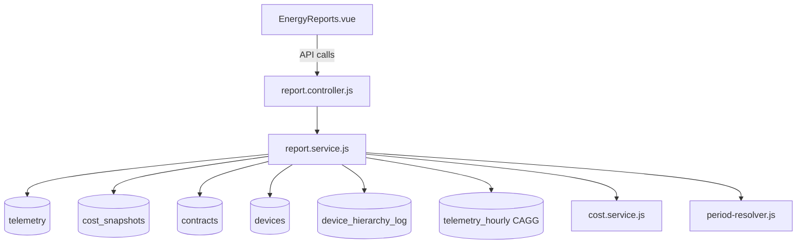

# Documentación Técnica: Informe Energético General de Fábrica

**Módulo:** Informes Energéticos — Vista de Fábrica  
**Backend:** [report.service.js](file:///Users/diegomartinez/Develop/fpsaver/backend/src/services/report.service.js)  
**Frontend:** [EnergyReports.vue](file:///Users/diegomartinez/Develop/fpsaver/frontend/src/views/factory/EnergyReports.vue)  
**API Base:** `GET /api/factories/:factoryId/reports/*`

---

## Índice

1. [Arquitectura General](#1-arquitectura-general)
2. [Tablas de Datos](#2-tablas-de-datos)
3. [Resumen KPIs (getSummary)](#3-resumen-kpis-getsummary)
4. [Coste por Periodo Tarifario (getCostByPeriod)](#4-coste-por-periodo-tarifario-getcostbyperiod)
5. [Curva de Demanda de Potencia (getPowerDemand)](#5-curva-de-demanda-de-potencia-getpowerdemand)
6. [Desglose por Máquina (getDeviceBreakdown)](#6-desglose-por-máquina-getdevicebreakdown)
7. [Calidad Eléctrica (getPowerQuality)](#7-calidad-eléctrica-getpowerquality)
   - 7.1 Energía Reactiva por Periodo
   - 7.2 Maxímetro
   - 7.3 Factor de Potencia (Timeline)
   - 7.4 Equilibrio de Fases
   - 7.5 Monitorización de Tensión
8. [Gestión del Histórico y Jerarquía](#8-gestión-del-histórico-y-jerarquía)
9. [Detección Trifásica / Monofásica](#9-detección-trifásica--monofásica)

---

## 1. Arquitectura General



El frontend hace **5 llamadas API paralelas** al cargar un rango de fechas:

| Endpoint | Función Backend | Descripción |
|----------|----------------|-------------|
| `/reports/summary` | `getSummary()` | KPIs globales: kWh, €, pico |
| `/reports/cost-by-period` | `getCostByPeriod()` | Stacked chart de € por P1-P6 |
| `/reports/power-demand` | `getPowerDemand()` | Curva de potencia horaria |
| `/reports/device-breakdown` | `getDeviceBreakdown()` | Desglose por máquina |
| `/reports/power-quality` | `getPowerQuality()` | Calidad eléctrica completa |

### Fuentes de datos duales

El sistema usa **dos fuentes de datos** dependiendo del rango:

| Rango | Fuente kWh/Coste | Fuente Calidad |
|-------|-------------------|----------------|
| **Día actual / día único** | `costService.getDailyCostBreakdown()` (cálculo en vivo desde telemetría raw) | Telemetría raw del contador general |
| **Multi-día / rango** | `cost_snapshots` (pre-calculados por hora) | Telemetría raw del contador general |

**Razón:** Para el día actual, los `cost_snapshots` aún no están completos. Para garantizar consistencia con el dashboard en tiempo real, se usa el mismo cálculo que el live view. La calidad eléctrica **siempre** usa telemetría raw para máxima precisión.

---

## 2. Tablas de Datos

### `telemetry` (TimescaleDB hypertable)

Frecuencia: cada **5 minutos** (288 muestras/día por dispositivo).

| Columna | Tipo | Descripción |
|---------|------|-------------|
| `time` | `timestamptz` | Marca temporal UTC |
| `device_id` | `uuid` | Dispositivo fuente |
| `power_w_total` | `float` | Potencia activa total (W) |
| `power_w_l1`, `l2`, `l3` | `float` | Potencia activa por fase (W) |
| `voltage_l1_n`, `l2_n`, `l3_n` | `float` | Tensión fase-neutro (V) |
| `current_l1`, `l2`, `l3` | `float` | Corriente por fase (A) |
| `power_factor` | `float` | cos φ (0-1) |
| `power_var_l1`, `l2`, `l3` | `float` | Potencia reactiva por fase (VAr) |

### `telemetry_hourly` (Continuous Aggregate)

Agregado automático de TimescaleDB. **NO se usa para cálculos de calidad eléctrica** (se usa raw telemetry). Se usa solo para el timeline del informe por máquina individual.

| Columna | Tipo | Descripción |
|---------|------|-------------|
| `bucket` | `timestamptz` | Hora (UTC bucket) |
| `device_id` | `uuid` | Dispositivo |
| `avg_power_w` | `float` | Media de W en la hora |
| `max_power_w` | `float` | Máximo de W en la hora |
| `samples` | `int` | Nº de muestras (normalmente 12) |

### `cost_snapshots` (nivel fábrica)

Generados cada hora por el servicio de costes. **No tienen `device_id`** — son el coste total de la fábrica.

| Columna | Tipo | Descripción |
|---------|------|-------------|
| `factory_id` | `uuid` | Fábrica |
| `timestamp` | `timestamptz` | Hora del snapshot |
| `period` | `varchar(3)` | Periodo tarifario (P1-P6) |
| `kwh_consumed` | `numeric` | kWh consumidos en esa hora |
| `cost_eur` | `numeric` | Coste en € de esa hora |
| `price_kwh` | `numeric` | Precio €/kWh aplicado |

### `contracts` (configuración de contrato)

| Columna | Uso |
|---------|-----|
| `tariff_type` | Tipo de tarifa (3.0TD, 6.1TD, 6.2TD, etc.) |
| `power_p1_kw` ... `power_p6_kw` | Potencia contratada por periodo (kW) |
| `reactive_penalty_threshold` | Umbral de penalización reactiva (default: 33%) |

### `device_hierarchy_log` (histórico de jerarquía)

| Columna | Tipo | Descripción |
|---------|------|-------------|
| `device_id` | `uuid` | Dispositivo hijo |
| `parent_device_id` | `uuid` | Dispositivo padre |
| `parent_relation` | `varchar` | `downstream` o `phase_channel` |
| `phase_channel` | `varchar` | `L1`, `L2`, `L3` (solo para fases virtuales) |
| `action` | `varchar` | `attached` o `detached` |
| `timestamp` | `timestamptz` | Cuándo se realizó el cambio |

---

## 3. Resumen KPIs (`getSummary`)

**Endpoint:** `GET /reports/summary?from=...&to=...`

### Datos devueltos

| KPI | Cálculo | Fuente |
|-----|---------|--------|
| `total_kwh` | Suma total de kWh consumidos | Día: live telemetry. Multi-día: `SUM(cost_snapshots.kwh_consumed)` |
| `total_cost` | Suma total en € | Día: live telemetry × precio. Multi-día: `SUM(cost_snapshots.cost_eur)` |
| `avg_price_kwh` | Precio medio €/kWh | `total_cost / total_kwh` |
| `peak_kw` | Pico de potencia en kW | `MAX(power_w_total) / 1000` — toma el mayor entre general meter y suma de sub-meters |
| `contracted_power_kw` | Potencia contratada P1 | De `contracts.power_p1_kw` |

### Cálculo del pico (hybrid)

```
peak_kw = MAX(
    MAX(general_meter.power_w_total),
    MAX(SUM_per_5min(sub_meters.power_w_total))
) / 1000
```

Se usa el mayor entre ambas fuentes para cubrir gaps cuando el general meter no existía.

---

## 4. Coste por Periodo Tarifario (`getCostByPeriod`)

**Endpoint:** `GET /reports/cost-by-period?from=...&to=...&groupBy=hour|day`

Genera los datos para el **gráfico stacked bar** de coste por periodo.

### Cálculo

- **Día único:** Usa `getDailyCostBreakdown()` que calcula en vivo desde telemetría
- **Multi-día:** Agrupa `cost_snapshots` por `time_bucket` y `period`:
  ```sql
  SELECT time_bucket('1 day', timestamp, 'Europe/Madrid') AS bucket,
         period, SUM(cost_eur), SUM(kwh_consumed)
  FROM cost_snapshots WHERE factory_id = $1
  GROUP BY bucket, period
  ```

### Clasificación de periodos

Usa [period-resolver.js](file:///Users/diegomartinez/Develop/fpsaver/backend/src/utils/period-resolver.js) que clasifica cada hora según:
- **Tipo de tarifa** (3.0TD = 3 periodos, 6.XTD = 6 periodos)
- **Temporada** (Alta A, Alta B, Media, Baja) según mes
- **Día de la semana** (laborable vs. fin de semana/festivo)
- **Festivos nacionales** (hardcoded: 1 enero, 6 enero, 1 mayo, etc.)

---

## 5. Curva de Demanda de Potencia (`getPowerDemand`)

**Endpoint:** `GET /reports/power-demand?from=...&to=...`

### Fuentes (método hybrid)

1. **General meter:** `AVG/MAX(power_w_total)` agrupado por hora
2. **Sub-meters:** `SUM(AVG(power_w_total))` de todos los sub-medidores, agrupado por hora

Para cada hora se toma **el mayor entre ambas fuentes**:

```javascript
avg_kw = MAX(general_meter.avg_kw, sub_meters.avg_kw)
max_kw = MAX(general_meter.max_kw, sub_meters.max_kw)
```

### Curvas por dispositivo

Además de la curva total, se calculan las curvas de potencia de los **top 5 dispositivos** (por avg_kw) excluyendo el general meter y dispositivos de fase virtual.

### Datos devueltos

- `data[]`: Array horario con `{ time, avg_kw, max_kw }`
- `per_device[]`: Top 5 dispositivos con sus curvas horarias
- `contracted_powers`: Potencia contratada per periodo (para línea de referencia en gráfico)

---

## 6. Desglose por Máquina (`getDeviceBreakdown`)

**Endpoint:** `GET /reports/device-breakdown?from=...&to=...`

### Cálculo de kWh por dispositivo

```
kWh = AVG(power_w_total) × (samples × 300s / 3600) / 1000
       ↑ media en watts       ↑ horas reales de operación
```

Donde `300s = 5 minutos` (intervalo de muestreo).

**Importante:** No se usa `SUM(watts × 5/60)` porque queremos `avg × horas_reales` para ser robustos ante samples faltantes.

### Precio medio

```
avgPrice = totalCostEur / totalKwh  (del día, o de cost_snapshots para multi-día)
cost_per_device = kwh × avgPrice
```

### Jerarquía padre-hijo

El sistema soporta dos tipos de relaciones:

| Relación | Descripción | Datos |
|----------|-------------|-------|
| `downstream` | Sub-medidor aguas abajo (ej: máquina medida dentro de una línea) | Lee `power_w_total` propio |
| `phase_channel` | Dispositivo virtual (L1/L2/L3 de un medidor padre) | Lee `power_w_L1/L2/L3` del padre |

#### Parent NET

```
parent_kwh_net = parent_kwh_gross - SUM(downstream_children_kwh)
```

Si una máquina padre mide 50 kWh y tiene un downstream de 15 kWh, el consumo NET del padre es 35 kWh (el downstream ya está contabilizado separado).

#### No monitorizado

```
unmonitored_kwh = total_factory_kwh - SUM(all_sub_meters_kwh)
```

Representa la energía consumida por equipos no monitorizados (iluminación, climatización, etc.).

### Jerarquía histórica

Se usa `device_hierarchy_log` con `DISTINCT ON (device_id)` y `timestamp <= to`, `action = 'attached'` para reconstruir la jerarquía vigente al final del rango consultado. Ver [sección 8](#8-gestión-del-histórico-y-jerarquía).

---

## 7. Calidad Eléctrica (`getPowerQuality`)

**Endpoint:** `GET /reports/power-quality?from=...&to=...`

**Fuente exclusiva:** Telemetría raw del **contador general** (`device_role = 'general_meter'`). 
No depende de jerarquía ni sub-medidores → funciona correctamente con cualquier rango histórico.

---

### 7.1 Energía Reactiva por Periodo Tarifario

**Normativa:** Circular 3/2020 CNMC

#### Proceso de cálculo

1. Se obtienen **todas las muestras raw** (5 min) del contador general para el rango
2. Cada muestra se clasifica en P1-P6 usando `resolvePeriod(timestamp, tariffType)`
3. Para cada periodo se acumulan:

```
kWh  = SUM(power_w_total × 5/60) / 1000     — energía activa
kVArh = SUM(|VAr_total| × 5/60) / 1000       — energía reactiva inductiva (valor absoluto)
```

Donde `VAr_total = power_var_l1 + power_var_l2 + power_var_l3`.

4. Se calcula por periodo:

| Métrica | Fórmula | Descripción |
|---------|---------|-------------|
| **Ratio** | `(kVArh / kWh) × 100` | Proporción de reactiva sobre activa (%) |
| **Exceso** | `max(0, kVArh − threshold × kWh)` | kVArh que exceden el umbral. `threshold` = 0.33 (configurable en contrato, campo `reactive_penalty_threshold`) |
| **Recargo** | `exceso × 0.041554` | Precio regulado ~0.041554 €/kVArh (tarifa 2024) |
| **cos φ** | `AVG(power_factor)` de las muestras del periodo | Media aritmética |

#### Interpretación del ratio

- **≤ 33%** (cos φ ≥ 0.95): Sin penalización ✅
- **> 33%** (cos φ < 0.95): Se factura el exceso ❌

#### Equivalencia cos φ ↔ ratio

```
cos φ = 0.95  →  tan φ = 0.329  →  ratio = 32.9%  ≈  33%
```

---

### 7.2 Maxímetro (Exceso de Potencia Contratada)

**Normativa:** RD 1164/2001

#### Proceso de cálculo

1. Las muestras (cada 5 min) se agrupan en **buckets de 15 minutos** por periodo tarifario
2. Para cada bucket de 15 min se calcula la **potencia media**:

```
avg_kw_15min = (SUM(watts_in_bucket) / count_in_bucket) / 1000
```

3. Se toma el **máximo** de todos los buckets de 15 min dentro de cada periodo
4. Se compara con la potencia contratada del periodo:

```
excess_pct = ((max_demand - contracted) / contracted) × 100
```

#### Bandas de penalización

| Exceso | Penalización | Multiplicador |
|--------|-------------|---------------|
| 0-5% | Dentro de tolerancia | ×0 (sin recargo) |
| 5-15% | Recargo doble del término de potencia | ×2 |
| >15% | Recargo triple del término de potencia | ×3 |

#### Por qué 15 minutos

La distribuidora registra la potencia media cada **cuarto de hora** (no el pico instantáneo). Un pico instantáneo de 200 kW durante 30 segundos no penaliza si la media de los 15 min no supera la contratada. El sistema replica este comportamiento agrupando las 3 muestras de 5 min en cada cuarto de hora y promediando.

---

### 7.3 Factor de Potencia (Timeline)

Gráfico horario del cos φ para visualización.

```sql
SELECT time_bucket('1 hour', time, 'Europe/Madrid') AS hour,
       AVG(power_factor) AS avg_pf,
       MIN(power_factor) AS min_pf,
       MAX(power_factor) AS max_pf
FROM telemetry
WHERE device_id = $general_meter_id
  AND power_factor > 0
GROUP BY hour
```

Se rellenan las horas sin datos con `null` para que el gráfico muestre gaps correctamente.

#### KPIs globales del PF

| KPI | Cálculo |
|-----|---------|
| `avg_pf` | Media ponderada global de todas las muestras con PF > 0 |
| `min_pf` | Mínimo absoluto de todo el rango |
| `hours_below_095` | Nº de horas donde el `avg_pf` horario fue < 0.95 |
| `status` | `excellent` (≥0.95), `warning` (0.90-0.95), `critical` (<0.90) |

---

### 7.4 Equilibrio de Fases

**Normativa:** EN 50160 (calidad de suministro eléctrico)  
**Solo visible en instalaciones trifásicas** (auto-detección, ver [sección 9](#9-detección-trifásica--monofásica))

#### Cálculo

```sql
SELECT AVG(voltage_l1_n), AVG(voltage_l2_n), AVG(voltage_l3_n),
       AVG(current_l1), AVG(current_l2), AVG(current_l3),
       AVG(power_w_l1), AVG(power_w_l2), AVG(power_w_l3)
FROM telemetry WHERE device_id = $general_meter AND voltage_l1_n > 0
```

#### Fórmula de desequilibrio

```
imbalance_% = (MAX(L1,L2,L3) − MIN(L1,L2,L3)) / AVG(L1,L2,L3) × 100
```

#### Umbrales

| Magnitud | OK | Warning | Critical | Efecto del desequilibrio |
|----------|-----|---------|----------|------------------------|
| **Tensión** | ≤2% | >2% | >5% | Corrientes desequilibradas, calentamiento en neutro |
| **Corriente** | ≤10% | >10% | >20% | Sobrecalentamiento de motores, disparo de protecciones |
| **Potencia** | ≤10% | >10% | >20% | Pérdidas eléctricas, reducción de capacidad del transformador |

---

### 7.5 Monitorización de Tensión

**Normativa:** EN 50160, Reglamento UE 2016/1388

#### Rango permitido

```
Nominal:  230V
Tolerancia: ±7%
Rango:    214.1V – 246.1V
```

#### Cálculo

```sql
-- Valores por fase
SELECT AVG(voltage_l1_n), MIN(voltage_l1_n), MAX(voltage_l1_n), ... (L2, L3)
FROM telemetry WHERE device_id = $gm AND voltage_l1_n > 0

-- Horas fuera de rango (solo fases activas)
SELECT COUNT(DISTINCT time_bucket('1 hour', time))
FROM telemetry WHERE device_id = $gm
  AND (voltage_l1_n < 214.1 OR voltage_l1_n > 246.1
    OR voltage_l2_n < 214.1 OR ...)  -- solo fases activas
```

#### Adaptación monofásica

En instalaciones monofásicas (ver [sección 9](#9-detección-trifásica--monofásica)):
- Solo se muestra y evalúa **L1**
- El campo `phases` en la respuesta contiene `['l1']` en lugar de `['l1','l2','l3']`

---

## 8. Gestión del Histórico y Jerarquía

### Tabla `device_hierarchy_log`

Cada vez que un dispositivo se asocia o desasocia de un padre, se registra:

```sql
-- Ejemplo: Máquina X se conecta como downstream de Línea A a las 10:00
INSERT INTO device_hierarchy_log (device_id, parent_device_id, parent_relation, action, timestamp)
VALUES ('machine_x', 'line_a', 'downstream', 'attached', '2026-03-11 10:00:00+01');

-- Más tarde, a las 14:00 se desconecta
INSERT INTO device_hierarchy_log (device_id, parent_device_id, parent_relation, action, timestamp)
VALUES ('machine_x', 'line_a', 'downstream', 'detached', '2026-03-11 14:00:00+01');
```

### Consulta de jerarquía vigente

```sql
SELECT DISTINCT ON (device_id) device_id, parent_device_id, parent_relation, action
FROM device_hierarchy_log
WHERE timestamp <= $to_date
ORDER BY device_id, timestamp DESC
```

Esto devuelve **el último evento** para cada dispositivo antes del final del rango. Si `action = 'attached'`, el dispositivo estaba conectado; si `'detached'`, estaba suelto.

### Limitación conocida

La jerarquía se evalúa como **snapshot al final del rango**, no subdivide el periodo. Si un downstream estuvo conectado 4h y luego se desconectó, el informe del día completo lo tratará según su **último estado**. Para informes granulares intra-día, se recomienda consultar rangos más cortos.

### Qué secciones dependen de jerarquía

| Sección | ¿Usa jerarquía? | Notas |
|---------|-----------------|-------|
| Resumen KPIs | ❌ | Solo cost_snapshots (factory-level) |
| Coste por Periodo | ❌ | Solo cost_snapshots |
| Curva de Demanda | ❌ | Hybrid: general meter + sub-meters independientes |
| Desglose por Máquina | ✅ | Usa `device_hierarchy_log` para parent NET |
| Calidad Eléctrica | ❌ | Solo contador general |

---

## 9. Detección Trifásica / Monofásica

### Método de detección

```javascript
const vl2 = parseFloat(pr.avg_v2) || 0;
isThreePhase = vl2 > 50; // L2 > 50V → trifásica
```

Si el contador general es un **EM111** (monofásico), las columnas `voltage_l2_n` y `voltage_l3_n` serán `NULL` o `0`. El sistema lo detecta automáticamente.

### Comportamiento por tipo

| Sección | Trifásica (EM340) | Monofásica (EM111) |
|---------|-------------------|-------------------|
| Reactiva por periodo | ✅ Normal | ✅ Normal (usa `power_var_l1` solamente) |
| Maxímetro | ✅ Normal | ✅ Normal (usa `power_w_total`) |
| PF Timeline | ✅ Normal | ✅ Normal (usa `power_factor`) |
| Equilibrio de Fases | ✅ Visible (V/I/W) | ❌ Oculto (`phase_balance = null`) |
| Tensión | ✅ L1/L2/L3 | ✅ Solo L1 (`phases: ['l1']`) |
